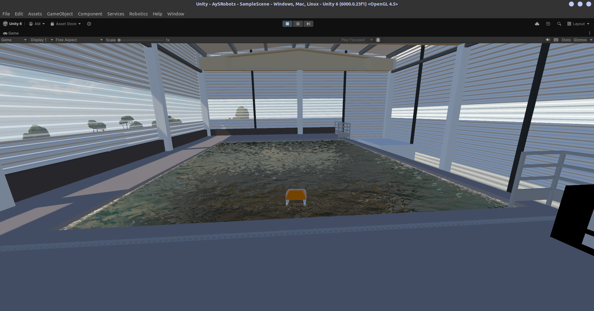
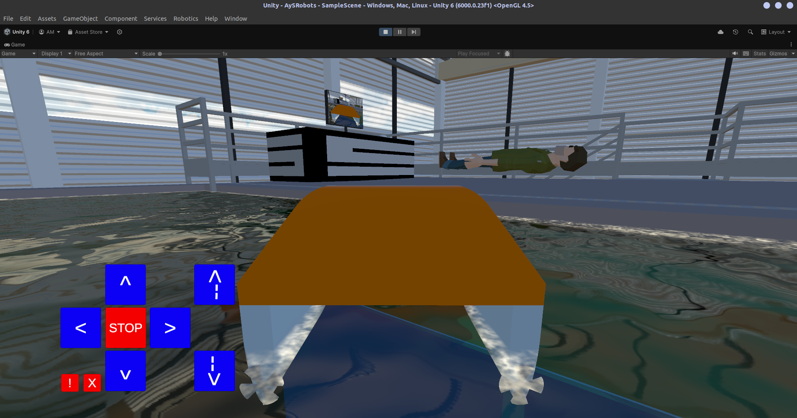
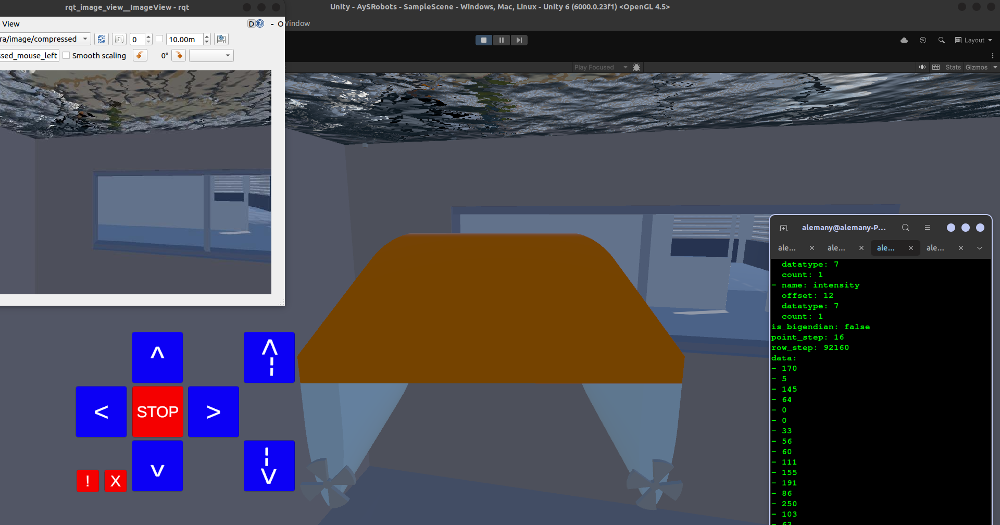
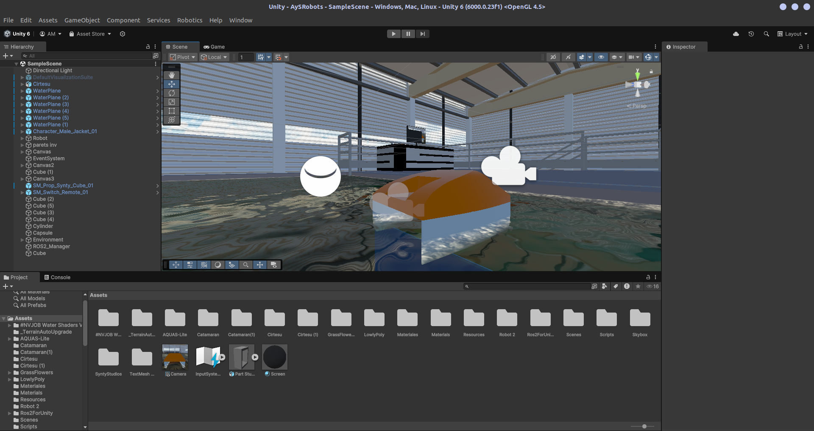
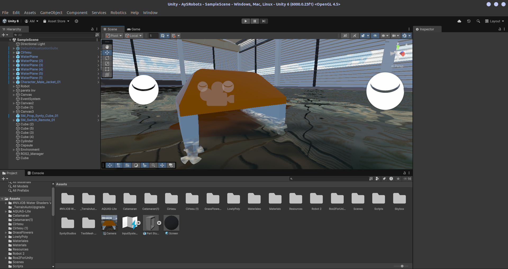
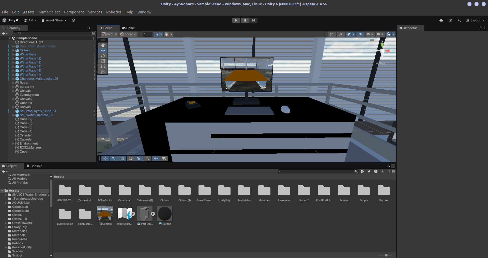
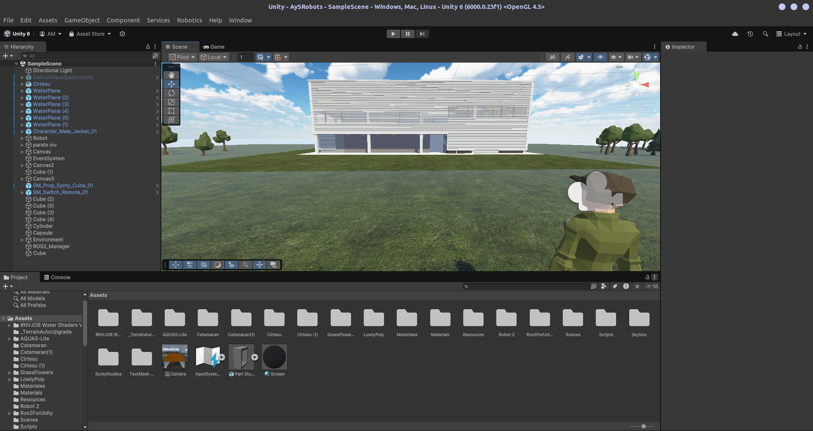
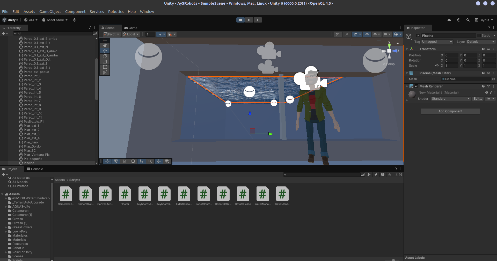

# Aerial and Submarine Robots: Unity ROS 2 Marine Digital Twin

This repository contains a physical and visual simulator in Unity for a marine vehicle remotely controlled via ROS 2. It functions as a Digital Twin that reacts in real-time to velocity and depth commands sent from the ROS ecosystem, developed as a practical project for the "Aerial and Submarine Robotics" course at Universitat Jaume I. The project presentation can be downloaded from: 
```bash
https://www.canva.com/design/DAHCLyPA4mQ/3D7wqMlQ-1GvoCRDURzWMw/edit?utm_content=DAHCLyPA4mQ&utm_campaign=designshare&utm_medium=link2&utm_source=sharebutton
```

## Concept
The core of this project is the `RobotROS2Subscriber.cs` script. This controller converts the Unity vehicle into a ROS 2 node that "listens" to the `/cmd_vel` topic. Upon receiving standard `geometry_msgs/Twist` commands, the robot applies 3D movement physics, manages a smart ballast system to submerge or surface, and animates its propellers differentially.

## Key Features
* 100% Plug & Play (Auto-discovery): No need to drag and drop components in the Unity Inspector. The script automatically finds and assigns the Rigidbody, the buoyancy system (Floater), and the propellers based on their relative 3D position (left/right).
* Depth Control (Spring-Damper): Instead of forcing the vertical position, the Z-axis alters the robot's target depth, allowing water physics to submerge it naturally without jittering or stuttering.
* Safe Physical Limits: Includes "invisible walls" on the Y-axis (between -0.421 and -5.274) acting as a physical hard stop, killing inertia instantly to prevent unwanted bouncing when reaching the surface or the seabed.
* Animated Differential Drive: Mathematically calculates the power each propeller should exert when turning or moving forward, animating the 3D models independently for a realistic look.

## Simulation Showcase

### In-Game Views (And Camera/Lidar Feed)
| | | |
|:---:|:---:|:---:|
|  |  |  |

### Editor & Scene Views (Physical Setup)
| | |
|:---:|:---:|
|  |  |
|  |  |

**(Super Happy Submarine Robotics Engineer supervising his work):**
<br>


## Requirements
* Unity 6 (Tested with standard Rigidbody physics).
* ROS 2 (Humble recommended on Ubuntu 22.04).
* ROS2ForUnity package (https://github.com/RobotecAI/ros2-for-unity) installed and built within the Unity project.

## Installation / Cloning
**⚠️ Important:** This repository uses Git Large File Storage (LFS) for high-fidelity 3D CAD models. You must have Git LFS installed on your system before cloning.

```bash
# Install Git LFS (Ubuntu)
sudo apt install git-lfs
git lfs install

# Clone the repository
git clone [https://github.com/adrialemany/AySRobots.git](https://github.com/adrialemany/AySRobots.git)
```

## Scene Setup
To make the simulator work correctly in your Unity scene:

1. Create an Empty GameObject in the scene and add the ROS2UnityComponent to it.
2. Drag your 3D robot model into the scene.
3. Ensure the robot has the following components/children:
   * A Rigidbody.
   * The Floater.cs script (handling water physics).
   * Two child objects with the RotateHelice.cs script (one positioned to the left of the robot -X and another to the right +X).
4. Add the RobotROS2Subscriber.cs script to the main object of your robot.
5. Important: If you have manual control scripts attached (such as KeyboardRobot.cs or UI button controllers), disable them. If multiple controllers fight to move the same Rigidbody, the robot will behave erratically.

## How to Launch and Use

### 1. Start the Simulator
Run:
```bash
source /opt/ros/humble/setup.bash
```
and open your Unity project from the terminal (you can open it through the hub) and press the Play button. The robot will initialize its node transparently and print the following to the Unity console:
`Suscrito automáticamente al topic: /cmd_vel`

### 2. Send commands from ROS 2
Open a terminal in your Linux environment with ROS 2 installed and source the distribution workspace (e.g., Humble):
```bash
source /opt/ros/humble/setup.bash
```
You can control the robot by publishing Twist messages directly. The axis mapping is as follows:

* `linear.x`: Forward (positive) / Backward (negative).
* `linear.z`: Dive velocity (Positive = ascends towards the surface, Negative = descends/dives).
* `angular.z`: Horizontal rotation (Yaw).

Test example (Move forward and dive simultaneously):

```bash
ros2 topic pub /cmd_vel geometry_msgs/Twist "{linear: {x: 3.0, y: 0.0, z: -1.0}, angular: {x: 0.0, y: 0.0, z: 0.0}}"
```
Upon executing this command, you will see the propellers activate in Unity, the robot will move forward, and it will begin to sink smoothly until it hits its lower depth limit.

### 3. Use Teleoperation Tools
You can use standard ROS packages to drive the robot with your physical keyboard or a gamepad without modifying anything in Unity:

```bash
sudo apt install ros-humble-teleop-twist-keyboard
ros2 run teleop_twist_keyboard teleop_twist_keyboard
```

## Advanced Ground Control Station (Python GUI)

This repository includes a fully featured, multi-threaded Teleoperation Console built with **PySide6**, **OpenCV**, and **Ultralytics (YOLOv8)**. It acts as the ultimate external brain for the Digital Twin, providing an intuitive interface to control the submarine and process its sensor data in real-time.

### Console Features:
* **Live Video & AI Perception:** Receives the `/camera/image/compressed` stream and runs a local YOLOv8 inference model. It renders bounding boxes, labels, and confidence scores directly on the video overlay.
* **LiDAR RADAR System:** Subscribes to the 4D PointCloud2 data and filters thousands of points in real-time to compute the closest obstacles in 5 directions (Front, Left, Right, Back, Down), acting as a virtual proximity radar.
* **Autonomous Target Tracking ("FOLLOW" Mode):** Click on any detected YOLO target from the UI list and press "FOLLOW". The robot will automatically calculate the yaw error to keep the object centered while using the frontal LiDAR data to approach it and stop exactly at the user-defined safe distance.
* **Advanced Keyboard Teleop:** Supports incremental speed ramps (holding keys increases velocity) with a deadman switch (auto-brakes if keys are released).
  * `W`/`S`: Forward/Backward
  * `A`/`D`: Yaw Left/Right
  * `Q`/`E`: Strafe Left/Right
  * `R`/`F`: Ascend/Descend
  * `Shift`: Turbo mode
  * `Space`: Emergency brake (All zero)
* **Recover (Relocate):** A dedicated press-and-hold UI button that publishes to the `/relocate` topic, instantly stabilizing the robot.

### Installation & Dependencies
To run the Ground Control Station, you need a few Python libraries and the ROS 2 CV bridge:

```bash
# Install the ROS 2 CV Bridge for image conversion
sudo apt install ros-humble-cv-bridge

# Install Python dependencies
python3 -m pip install --user -U PySide6 ultralytics opencv-python numpy sensor_msgs_py
```

### Launching the Console
Ensure your ROS 2 environment is sourced, the Unity simulation is running, and then execute the script:

```bash
python3 teleop_submarine.py
```

## Interfacing with the Robot (ROS 2 Topics)

The Unity Digital Twin acts as a standard ROS 2 node, allowing you to build external graphical user interfaces (GUIs), autonomous navigation stacks, or AI vision scripts using standard ROS 2 tools (Python, C++, or web-based frameworks like Foxglove Studio).

### Active Topics Dictionary

#### 1. Command Velocity (Input to Unity)
* **Topic:** `/cmd_vel`
* **Message Type:** `geometry_msgs/msg/Twist`
* **Role:** External applications act as **Publishers**, Unity acts as a **Subscriber**.
* **Usage:** Publish to this topic to move the robot. 
  * `linear.x`: Controls forward and backward speed.
  * `linear.z`: Controls the ballast system for depth (positive to dive, negative to surface).
  * `angular.z`: Controls the differential yaw rotation.

#### 2. Camera Stream (Output from Unity)
* **Topic:** `/camera/image/compressed`
* **Message Type:** `sensor_msgs/msg/CompressedImage`
* **Role:** Unity acts as a **Publisher**, external applications act as **Subscribers**.
* **Usage:** Subscribe to this topic to receive the live video feed. The images are encoded in JPEG format to optimize bandwidth. You can decode them using libraries like OpenCV in Python (e.g., `cv2.imdecode`) for computer vision tasks or UI rendering.

#### 3. 4D LiDAR Point Cloud (Output from Unity)
* **Topic:** `/lidar/points`
* **Message Type:** `sensor_msgs/msg/PointCloud2`
* **Role:** Unity acts as a **Publisher**, external applications act as **Subscribers**.
* **Usage:** Subscribe to this topic to get spatial data plus simulated laser return intensity. The data is formatted with standard `x`, `y`, `z`, and `intensity` fields (Float32). Useful for SLAM algorithms, obstacle avoidance, or 3D visualizers.

#### 4. Emergency Stop / Relocate (Input to Unity)
* **Topic:** `/relocate`
* **Message Type:** `std_msgs/msg/Bool`
* **Role:** External applications act as **Publishers**, Unity acts as a **Subscriber**.
* **Usage:** Publish a `true` boolean message to this topic to instantly kill all linear and angular inertia. The robot will stabilize at its current depth and reset its movement targets. Perfect for "kill switch" implementations.

### Building an External Interface (Python Example)

If you are building an external dashboard or control script using `rclpy`, your node setup must mirror the Unity configuration. Here is a conceptual template of how an external interface connects to the simulator:

```python
import rclpy
from rclpy.node import Node
from geometry_msgs.msg import Twist
from sensor_msgs.msg import CompressedImage, PointCloud2
import cv2
import numpy as np
from std_msgs.msg import Bool

class ExternalRobotInterface(Node):
    def __init__(self):
        super().__init__('external_ui_node')
        
        # 1. PUBLISHER: Send commands TO the Unity robot
        self.cmd_pub = self.create_publisher(Twist, '/cmd_vel', 10)
        
        # 2. SUBSCRIBERS: Receive sensor data FROM the Unity robot
        self.cam_sub = self.create_subscription(CompressedImage, '/camera/image/compressed', self.camera_callback, 10)
        self.lidar_sub = self.create_subscription(PointCloud2, '/lidar/points', self.lidar_callback, 10)
        self.relocate_pub = self.create_publisher(Bool, '/relocate', 10)

    def trigger_emergency_stop(self):
        """Instantly stabilizes the robot at its current depth"""
        msg = Bool()
        msg.data = True
        self.relocate_pub.publish(msg)

    def move_robot(self, forward_speed, dive_speed, turn_speed):
        """Call this function from your UI buttons or gamepad"""
        msg = Twist()
        msg.linear.x = float(forward_speed)
        msg.linear.z = float(dive_speed)
        msg.angular.z = float(turn_speed)
        self.cmd_pub.publish(msg)

    def camera_callback(self, msg):
        """Decode the JPEG stream from Unity for UI display or OpenCV"""
        np_arr = np.frombuffer(msg.data, np.uint8)
        image_np = cv2.imdecode(np_arr, cv2.IMREAD_COLOR)
        # Add your UI rendering or image processing logic here

    def lidar_callback(self, msg):
        """Process the 4D point cloud data"""
        # Add your 3D visualization or filtering logic here
        pass

def main(args=None):
    rclpy.init(args=args)
    ui_node = ExternalRobotInterface()
    rclpy.spin(ui_node)
    ui_node.destroy_node()
    rclpy.shutdown()

if __name__ == '__main__':
    main()
```
---
Developed for marine robotics simulation using Unity and ROS 2.
